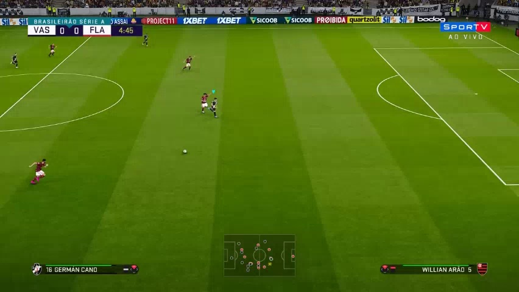
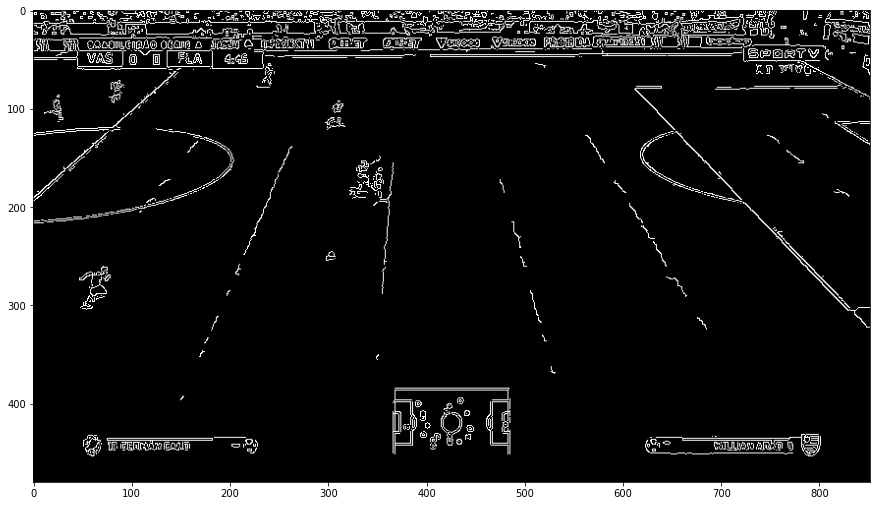

# Projeto de computação visual
## Problema
- Calcular a distância relativa de jogadores de futebol em uma imagem em perspectiva.

- Não existem informações sobre calibração da câmera

- Esse problema tem como premissa a existência de retas paralelas no mundo 3D visíveis na imagem em perspectiva
## Abordagem

- Para calcular distâncias de pontos em imagem em perspectiva, foi feita abordagem baseada em retificação de imagem através da matriz homográfica conforme o livro de Hartley e  Zisserman[5]
Está sendo utilizada uma combinação de técnicas baseadas em dois artigos:

    - [YOLO4](https://arxiv.org/pdf/2004.10934.pdf) - (Estado da arte em detecção de objetos)
        - Detecção de objeto via YOLO4.
    - [Auto-Rectification of User Photos](https://static.googleusercontent.com/media/research.google.com/en//pubs/archive/42532.pdf)
        - Calcular a distância relativa de jogadores de futebol em uma imagem em perspectiva através da matriz homográfica.

### Etapas

### Ambiente
- matplotlib=3.0.0
- numpy=1.14.2
- python=3.5.6
- tensorflow=1.10.0
- keras=2.1.5
- scikit-image=0.14.0

Baixar modelo no formato h5 e colocar na raiz do projeto
- [trained_weights_final.h5](https://drive.google.com/file/d/1qjungHMO8nIpct2ajT3wnIVOGZIYWlmC/view?usp=sharing) (modelo treinado)

## Referência

[Auto-Rectification of user photos](https://static.googleusercontent.com/media/research.google.com/en//pubs/archive/42532.pdf)

[YOLOv4: Optimal Speed and Accuracy of Object Detection](https://arxiv.org/pdf/2004.10934.pdf)

[Horizon Lines in the Wild](http://www.bmva.org/bmvc/2016/papers/paper020/index.html)

[An Improved Deep Learning Architecture for Person Re-Identification](http://openaccess.thecvf.com/content_cvpr_2015/papers/Ahmed_An_Improved_Deep_2015_CVPR_paper.pdf)
